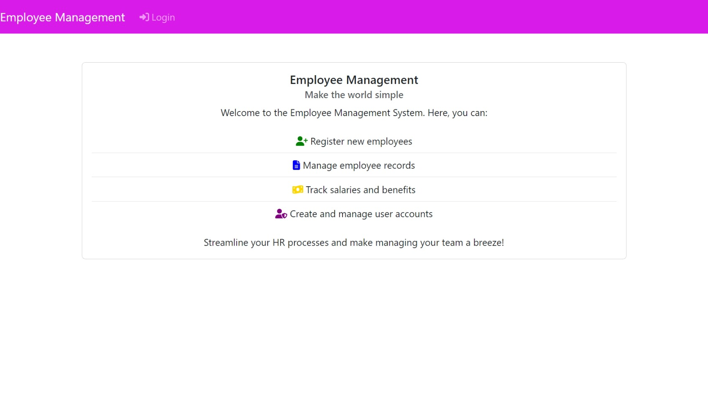
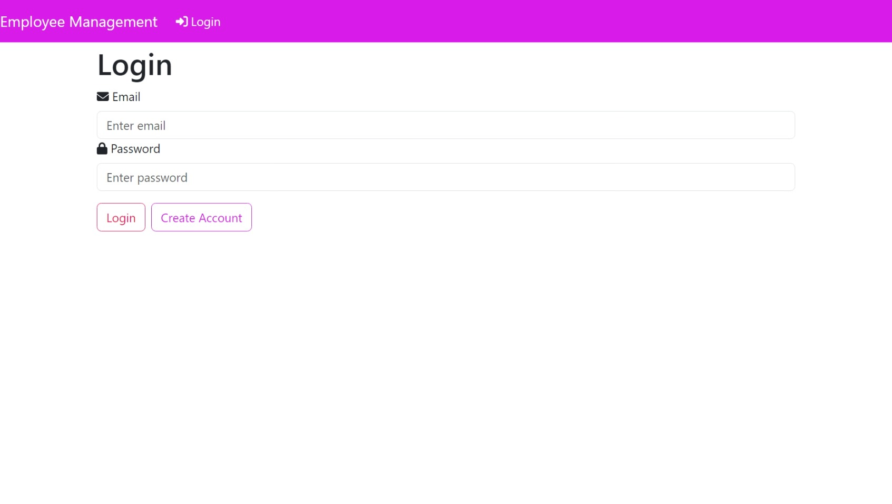
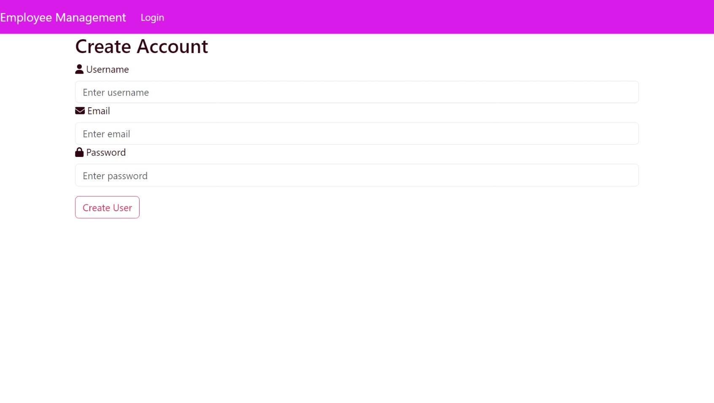
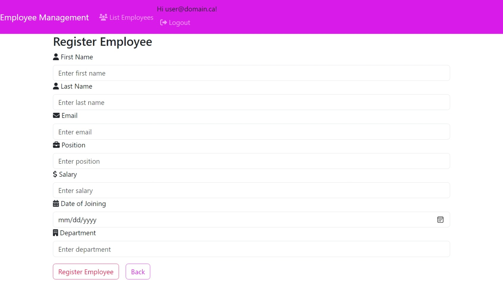
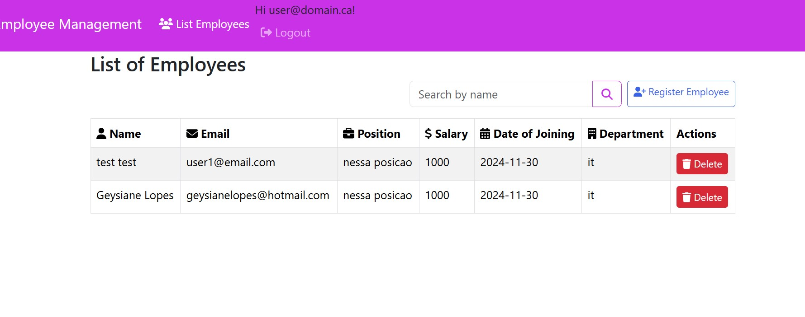

# Employee Management

## Requirements

- docker
- docker compose

- For development
  - node v22
  - npm

## How to run

- As developer, if you want to debug the react application
  run on powersheel

```
.\debug-frontend.ps1
```

then go to `.\src\frontend` and run

```
npm start
```

the
page will open in [http://localhost:3002](http://localhost:3002)

## Some Screenshots

- Home
  

- Login
  

- Create Account
  

- Register Employee
  

- Register Employee
  
